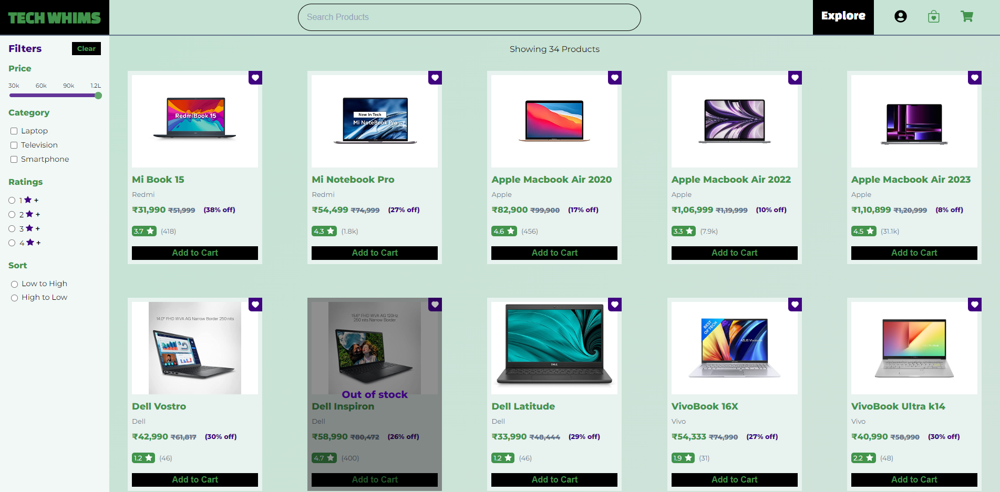
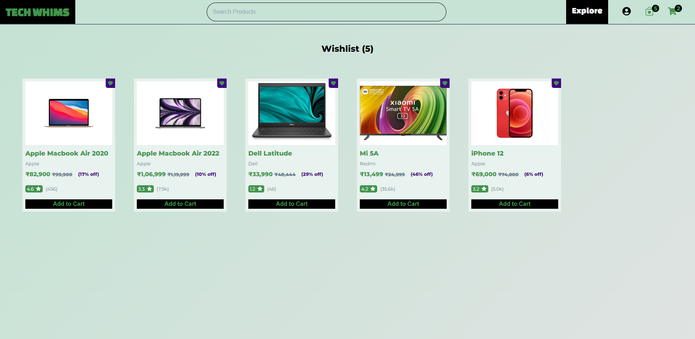
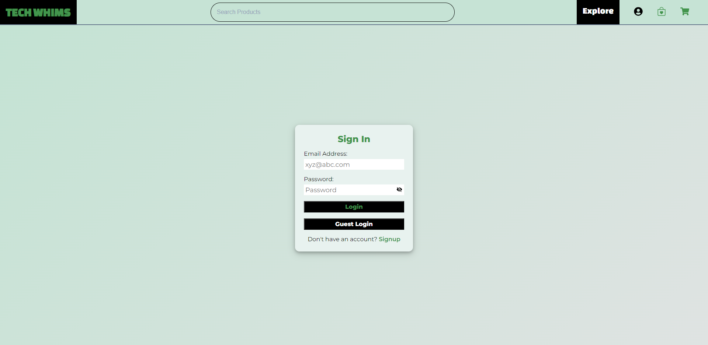
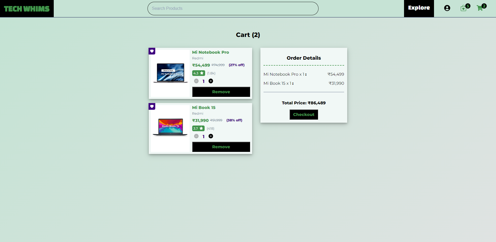
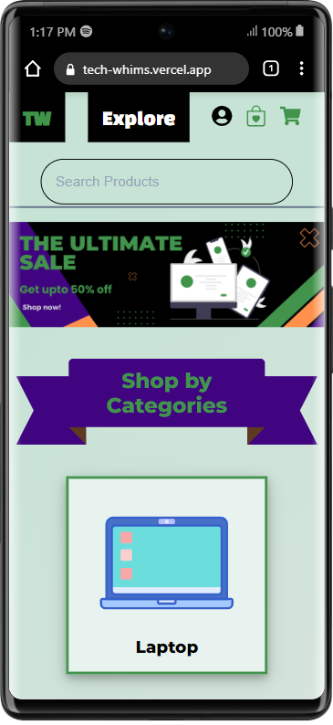
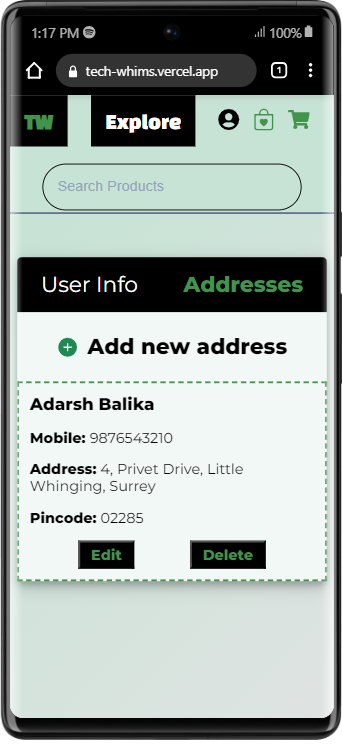

<div align="center">
    
# Tech Whims
  An Ecommerce website to buy all the tech products on your daily whims
</div>

## **How to install and run locally ?**

```
$ git clone https://github.com/jagrut-sharma/tech-whims.git
$ cd tech-whims
$ npm install
$ npm start
```

## **Features -**

- Home page
- Product listing page
- Filter and sort products
- Search product
- Individual product page
- Cart Managment
- Wishlist managment
- Address Managment
- Checkout page
- Payment gateway integration
- Authentication:
  - User Signup
  - User Login
- Fully Responsive

## **Built with -**

- React JS
- React Context API + useReducer
- React Router v6.4
- Vanilla CSS
- Razorpay payment gateway

## **Screenshots :**

### Home Page:


### Product Page:



### Wishlist Page:



### Sign in Page:



### Cart Page:



### Responsive design:




